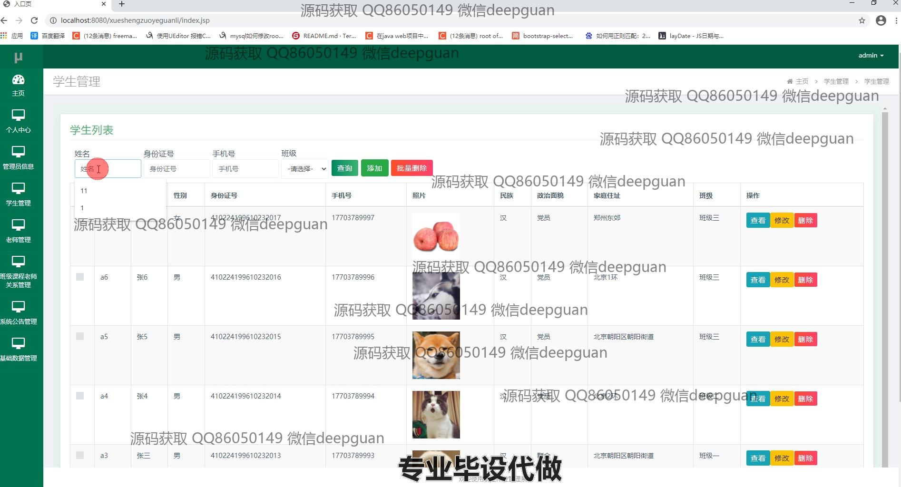
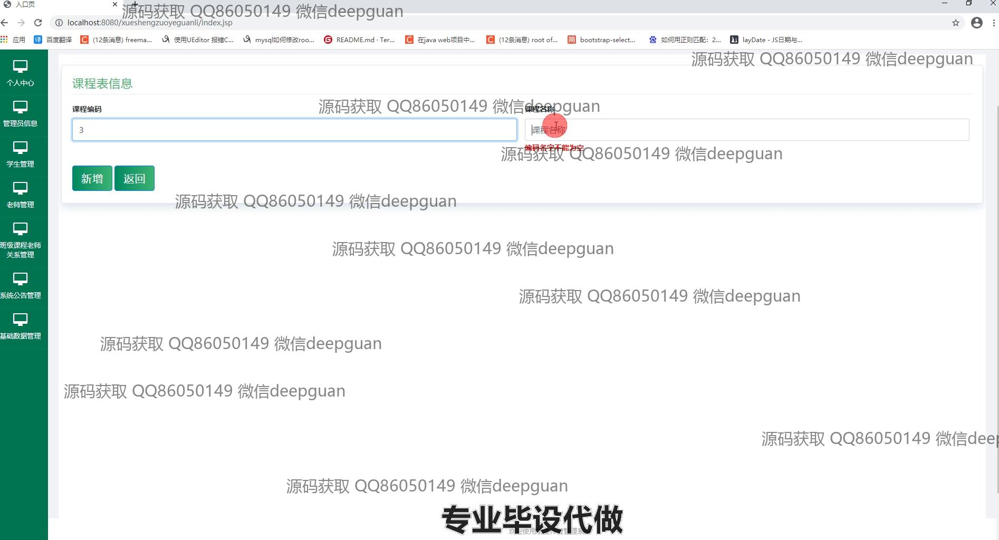
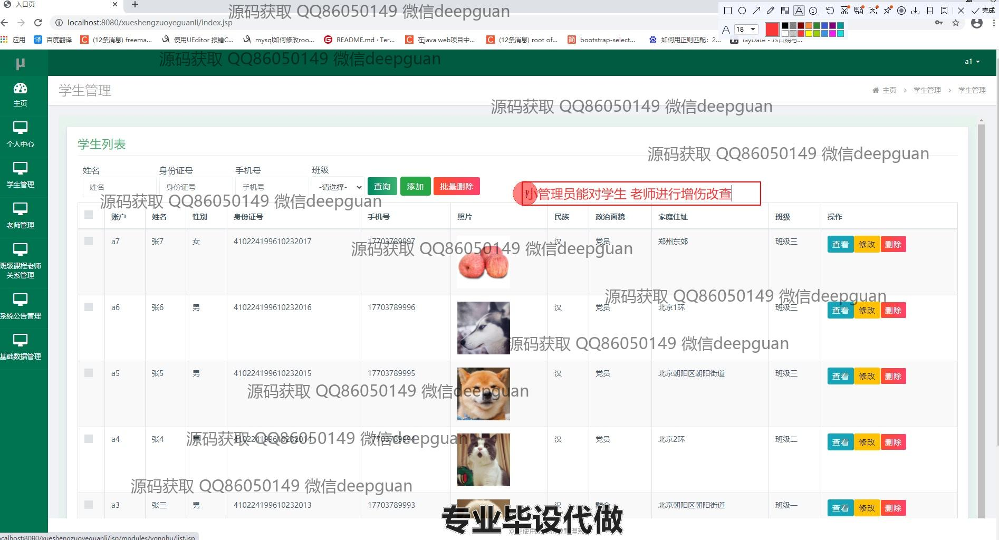

<h1 align="center">基于jsp的学生作业管理系统</h1>

## 简介
学生作业管理系统：提供安全的登录功能，角色分为管理员、教师和学生；具备学生信息管理、作业管理、班级课程管理、系统公告管理功能，实现高效的用户信息和作业处理。    --计算机毕业设计源码；毕设源码；java毕业设计源码

## 联系方式

<h3 align="center">获取完整代码与数据库文件 + 微信：deepguan QQ: 86050149 QQ群: 783742310</h3>

<h3 align="center">可帮忙远程部署 包运行成功！提供远程部署、修改代码、设计文档指导、代码讲解等服务！</h3>

## 功能介绍（完整见运行截图）
管理员：管理员可以通过登录界面输入用户名、密码及选择角色进行登录，具备学生、教师信息管理和管理员账户信息的查看与修改功能。管理员可以添加、修改、删除学生和教师的基本信息，以及管理系统公告和课程信息。导航菜单提供多个功能模块，包括个人中心、学生管理、教师管理、公告管理等，便于高效地对系统内各模块进行管理与维护。

学生：学生通过登录系统后，可以查看并提交作业，获取教师的反馈和评分，同时也可以查看自己的课程安排。学生可通过个人中心修改并更新自己的个人信息，如姓名、身份证号、手机号码等。系统内还支持对当前及历史作业的查看与下载，方便学生进行个人作业管理，并与教师有效互动。

教师：教师在登录系统后拥有布置、查看、批改及管理学生作业的权限。他们可以通过下拉菜单选择相应的班级与课程，传达详细作业要求并上传相关文件。教师可使用系统工具对作业的提交状态进行审核及管理，并为学生提供反馈意见，确保教学任务的顺利进行。

游客：游客访问系统时只能查看公共信息，比如一些系统公告或课程简介，不能进行任何数据修改或查看个人信息的操作。游客可通过注册页面创建新账户，以访问系统的更多功能。

## 运行截图

本代码来源于网络,仅供学习参考使用!

